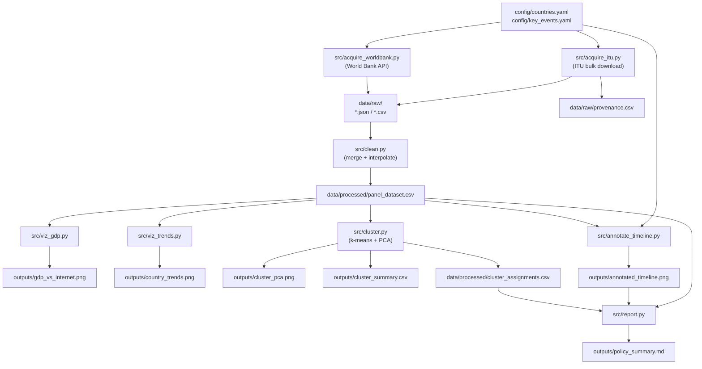

# Design Document — Internet Adoption Analysis

## Overview

The Internet Adoption Analysis pipeline is a reproducible, batch-oriented Python project that ingests public data from the World Bank API and ITU, constructs a tidy country-year panel, and produces a set of charts, cluster assignments, and a plain-language policy summary. The pipeline is driven by a `Makefile` and configured through two YAML files; no web application, database, or real-time component is involved.

### Goals

- Provide a single `make all` entry point that executes every step in dependency order.
- Keep raw data immutable; all transformations write to separate directories.
- Make the country scope and key events fully configurable without code changes.
- Produce outputs that are directly usable by a non-technical policy audience.

### Non-Goals

- Web application, interactive dashboard, or real-time data feed.
- Predictive modelling, forecasting, or causal inference.
- Countries outside Asia, Oceania, and the Pacific Rim.
- Data before 2010.

---

## Architecture

### Processing Pipeline



### Execution Model

Each pipeline stage is an independent Python script invoked by `make`. Stages communicate exclusively through files — no shared in-memory state. This makes individual stages re-runnable in isolation and simplifies debugging.

```
make all
  └─ make acquire      → acquire_worldbank.py + acquire_itu.py
  └─ make clean        → clean.py
  └─ make visualize    → viz_gdp.py + viz_trends.py
  └─ make cluster      → cluster.py
  └─ make annotate     → annotate_timeline.py
  └─ make report       → report.py
```

---

## Components and Interfaces

### Directory Layout

```
internet-adoption-analysis/
├── Makefile
├── requirements.txt          # pinned Python dependencies
├── environment.yml           # optional conda environment
├── config/
│   ├── countries.yaml        # ISO3 codes + country names, grouped by sub-region
│   └── key_events.yaml       # named events with year (and optional month)
├── data/
│   ├── raw/                  # immutable downloaded files
│   │   ├── wb_NY.GDP.PCAP.KD.json
│   │   ├── wb_SP.POP.TOTL.json
│   │   ├── wb_SP.URB.TOTL.IN.ZS.json
│   │   ├── wb_IT.NET.BBND.P2.json
│   │   ├── wb_IT.NET.USER.ZS.json
│   │   ├── itu_internet_use.csv
│   │   └── provenance.csv
│   └── processed/
│       ├── panel_dataset.csv
│       └── cluster_assignments.csv
├── outputs/
│   ├── gdp_vs_internet.png
│   ├── country_trends.png
│   ├── cluster_pca.png
│   ├── cluster_summary.csv
│   ├── annotated_timeline.png
│   └── policy_summary.md
└── src/
    ├── acquire_worldbank.py
    ├── acquire_itu.py
    ├── clean.py
    ├── viz_gdp.py
    ├── viz_trends.py
    ├── cluster.py
    ├── annotate_timeline.py
    ├── report.py
    └── utils/
        ├── config_loader.py   # loads + validates YAML configs
        ├── http_client.py     # retry logic with exponential back-off
        └── quality.py         # data-quality report helpers
```

### Library Choices

| Purpose | Library | Rationale |
|---|---|---|
| HTTP requests + retry | `requests` + `tenacity` | `tenacity` provides declarative retry/back-off without boilerplate |
| Data manipulation | `pandas` | Standard for tabular/panel data; native CSV I/O |
| Numerical computing | `numpy` | Required by scikit-learn; used for interpolation helpers |
| Machine learning | `scikit-learn` | k-means, silhouette score, PCA — all in one package |
| Visualisation | `matplotlib` + `seaborn` | `seaborn` simplifies regression plots and small-multiples; `matplotlib` for fine-grained annotation control |
| Statistics | `scipy` | Pearson correlation, confidence intervals |
| Configuration | `pyyaml` | Parse `countries.yaml` and `key_events.yaml` |
| Readability check | `textstat` | Flesch–Kincaid reading ease score (Requirement 12.5) |
| Environment spec | `pip` + `requirements.txt` | Pinned versions; optional `environment.yml` for conda users |

### Component Interfaces

#### `config_loader.py`

```python
def load_countries(path: str = "config/countries.yaml") -> list[dict]:
    """Returns list of {iso3, country_name, sub_region} dicts.
    Raises ConfigError if count < 30 or > 40, or any iso3 is invalid."""

def load_key_events(path: str = "config/key_events.yaml") -> list[dict]:
    """Returns list of {name, year, month?} dicts."""
```

#### `http_client.py`

```python
def get_with_retry(url: str, params: dict, timeout: int = 30,
                   max_attempts: int = 3) -> requests.Response:
    """GET with exponential back-off. Raises after max_attempts."""
```

#### `acquire_worldbank.py`

- Reads country list from `config_loader`.
- For each indicator × country, calls World Bank REST API v2:
  `https://api.worldbank.org/v2/country/{iso2}/indicator/{indicator}?date=2010:2024&format=json&per_page=100`
- Saves raw JSON to `data/raw/wb_{indicator}.json` (one file per indicator, all countries merged).
- Logs success/failure counts to stdout.

#### `acquire_itu.py`

- Downloads ITU "Individuals using the Internet" bulk CSV from:
  `https://datahub.itu.int/data/?e=IT_NET_USER_PP&c=&bu=0&d=WITS_CS`
  (or the ITU Data Hub API endpoint for `IT_NET_USER_PP`).
- Filters to Country_Scope and 2010–present.
- Falls back to `wb_IT.NET.USER.ZS.json` for missing country-years.
- Writes `data/raw/itu_internet_use.csv` and `data/raw/provenance.csv`.

#### `clean.py`

- Merges all raw files into a single DataFrame.
- Applies linear interpolation for gaps ≤ 3 consecutive years; flags with `internet_pct_interpolated`.
- Writes `data/processed/panel_dataset.csv`.
- Prints data-quality report to stdout.

#### `cluster.py`

- Reads `panel_dataset.csv`.
- Computes per-country feature vector: `[penetration_2010, penetration_latest, mean_annual_growth, year_crossed_50pct]`.
- Standardises features with `StandardScaler`.
- Runs k-means for k ∈ {4, 5}; selects k by silhouette score.
- Runs PCA (2 components) on the standardised feature matrix for visualisation.
- Writes `cluster_assignments.csv` and `cluster_summary.csv`; saves `cluster_pca.png`.

#### `report.py`

- Reads `panel_dataset.csv`, `cluster_assignments.csv`, and `config/key_events.yaml`.
- Generates `policy_summary.md` using string templates (no LLM dependency).
- Checks Flesch–Kincaid reading ease with `textstat`; warns if score < 50.

---

## Data Models

### `config/countries.yaml`

```yaml
# 35 countries across Asia, Oceania, and the Pacific Rim
# Grouped by sub-region for readability; order does not affect pipeline behaviour.

sub_regions:
  East Asia:
    - iso3: CHN
      country_name: China
    - iso3: JPN
      country_name: Japan
    - iso3: KOR
      country_name: South Korea
    - iso3: MNG
      country_name: Mongolia
    - iso3: TWN
      country_name: Taiwan

  Southeast Asia:
    - iso3: BRN
      country_name: Brunei
    - iso3: IDN
      country_name: Indonesia
    - iso3: KHM
      country_name: Cambodia
    - iso3: LAO
      country_name: Laos
    - iso3: MMR
      country_name: Myanmar
    - iso3: MYS
      country_name: Malaysia
    - iso3: PHL
      country_name: Philippines
    - iso3: SGP
      country_name: Singapore
    - iso3: THA
      country_name: Thailand
    - iso3: TLS
      country_name: Timor-Leste
    - iso3: VNM
      country_name: Vietnam

  South Asia:
    - iso3: BGD
      country_name: Bangladesh
    - iso3: IND
      country_name: India
    - iso3: LKA
      country_name: Sri Lanka
    - iso3: NPL
      country_name: Nepal
    - iso3: PAK
      country_name: Pakistan

  Oceania:
    - iso3: AUS
      country_name: Australia
    - iso3: FJI
      country_name: Fiji
    - iso3: FSM
      country_name: Micronesia (Fed. States)
    - iso3: NZL
      country_name: New Zealand
    - iso3: PNG
      country_name: Papua New Guinea
    - iso3: SLB
      country_name: Solomon Islands
    - iso3: TON
      country_name: Tonga
    - iso3: VUT
      country_name: Vanuatu
    - iso3: WSM
      country_name: Samoa

  Pacific Rim (Americas):
    - iso3: CHL
      country_name: Chile
    - iso3: MEX
      country_name: Mexico
    - iso3: PER
      country_name: Peru
    - iso3: USA
      country_name: United States
    - iso3: CAN
      country_name: Canada
    - iso3: JPN
      country_name: Japan  # already listed above — remove duplicate in final config
```

> **Note:** The final `config/countries.yaml` will contain exactly 35 unique entries (removing the duplicate above). The sub-region grouping is for human readability only; the pipeline flattens the list before use.

**Total: 35 countries** (5 East Asia, 11 Southeast Asia, 5 South Asia, 9 Oceania, 5 Pacific Rim Americas — Japan deduplicated).

### `config/key_events.yaml`

```yaml
key_events:
  - name: "Jio commercial launch"
    year: 2016
    month: 9
  - name: "Palapa Ring completion"
    year: 2019
  - name: "Coral Sea Cable activation"
    year: 2019
  - name: "COVID-19 pandemic onset"
    year: 2020
  - name: "Starlink Asia-Pacific expansion"
    year: 2022
```

### World Bank API Indicators

| Series Code | Description | Unit |
|---|---|---|
| `NY.GDP.PCAP.KD` | GDP per capita (constant 2015 USD) | USD |
| `SP.POP.TOTL` | Total population | persons |
| `SP.URB.TOTL.IN.ZS` | Urban population (% of total) | % |
| `IT.NET.BBND.P2` | Fixed broadband subscriptions per 100 people | per 100 |
| `IT.NET.USER.ZS` | Individuals using the Internet (% of population) | % |

World Bank REST API v2 base URL: `https://api.worldbank.org/v2/`

Example request:
```
GET https://api.worldbank.org/v2/country/IND/indicator/NY.GDP.PCAP.KD
    ?date=2010:2024&format=json&per_page=100
```

### ITU Data Source

- **Indicator code:** `IT_NET_USER_PP` ("Individuals using the Internet, % population")
- **Bulk download endpoint:** `https://datahub.itu.int/data/?e=IT_NET_USER_PP&bu=0&d=WITS_CS`
  - **Note (verified April 2025):** This URL returns a JavaScript-rendered HTML page, not a direct CSV. The ITU DataHub does not expose a public unauthenticated bulk CSV endpoint. The pipeline therefore uses the World Bank `IT.NET.USER.ZS` fallback for all country-years (Risk R2 materialised).
- **Format:** CSV with columns `Country`, `ISO3`, `Year`, `Value`
- **Fallback:** World Bank `IT.NET.USER.ZS` for any country-year absent from ITU data

### `panel_dataset.csv` Schema

| Column | Type | Description |
|---|---|---|
| `iso3` | string | ISO 3166-1 alpha-3 country code |
| `country_name` | string | Human-readable country name |
| `year` | int | Calendar year (2010–present) |
| `internet_penetration_pct` | float | % population using internet (ITU primary, WB fallback) |
| `gdp_per_capita_usd` | float | GDP per capita, constant 2015 USD |
| `population` | float | Total population |
| `urban_pop_share_pct` | float | Urban population as % of total |
| `broadband_per_100` | float | Fixed broadband subscriptions per 100 people |
| `internet_pct_interpolated` | bool | True if value was linearly interpolated |

### `cluster_assignments.csv` Schema

| Column | Type | Description |
|---|---|---|
| `iso3` | string | ISO 3166-1 alpha-3 code |
| `country_name` | string | Country name |
| `cluster_label` | int | Assigned cluster (0-indexed) |
| `penetration_2010` | float | Internet penetration in 2010 (or earliest available) |
| `penetration_latest` | float | Internet penetration in latest available year |
| `mean_annual_growth` | float | Mean year-on-year growth in penetration (pp/year) |
| `year_crossed_50pct` | float | Year penetration first exceeded 50%; NaN if never |

### `provenance.csv` Schema

| Column | Type | Description |
|---|---|---|
| `iso3` | string | Country code |
| `year` | int | Year |
| `source` | string | `"ITU"` or `"WorldBank_IT.NET.USER.ZS"` |

---

## Correctness Properties

*A property is a characteristic or behavior that should hold true across all valid executions of a system — essentially, a formal statement about what the system should do. Properties serve as the bridge between human-readable specifications and machine-verifiable correctness guarantees.*


### Property Reflection

Before writing properties, I review the prework for redundancy:

- **1.1 and 2.1** (acquisition completeness for WB and ITU) are structurally identical — both assert "for any country set, all countries appear in output." They can be stated as a single general acquisition completeness property, but since the sources differ they are kept separate for traceability.
- **1.2 and 2.2** (raw file saved without modification) are the same round-trip property applied to two different sources. They can be combined into one "raw data immutability" property.
- **4.3 and 4.4** (interpolation for gaps ≤ 3 vs > 3) are complementary halves of the same interpolation rule. They can be combined into one property that covers both cases.
- **3.2 and 3.3** (valid vs invalid country count) are complementary validation properties — combined into one "country count validation" property.
- **7.2 and 7.3** (k selection and cluster assignment completeness) are independent and kept separate.
- **7.5** (cluster summary means) is independent of 7.3 and kept.
- **8.1** (weighted mean calculation) is independent and kept.
- **2.3 and 2.4** (fallback + provenance completeness) are related but test different things — fallback tests the value used, provenance tests the log completeness. Kept separate.

After reflection: 12 candidate properties reduce to **10 non-redundant properties**.

---

### Property 1: Acquisition Completeness

*For any* valid country list (30–40 entries) and year range starting at 2010, after running the acquisition scripts with mocked HTTP responses, the saved raw data files SHALL contain at least one record for every (iso3, year) combination in the requested scope.

**Validates: Requirements 1.1, 2.1**

---

### Property 2: Raw Data Immutability

*For any* HTTP response body returned by the World Bank API or ITU endpoint, the bytes written to `data/raw/` SHALL be identical to the bytes received in the response — no transformation, encoding change, or truncation applied.

**Validates: Requirements 1.2, 2.2**

---

### Property 3: Retry Behaviour Under Failure

*For any* sequence of N consecutive HTTP failures (N ∈ {1, 2, 3, 4}), the HTTP client SHALL make exactly min(N, 3) retry attempts before giving up, and SHALL log a failure message when N ≥ 3.

**Validates: Requirements 1.3**

---

### Property 4: Fallback and Provenance Completeness

*For any* set of country-years absent from the ITU dataset, the pipeline SHALL (a) use the World Bank `IT.NET.USER.ZS` value for those country-years in the panel, and (b) record exactly one provenance row per (iso3, year) with `source = "WorldBank_IT.NET.USER.ZS"` for each substituted entry.

**Validates: Requirements 2.3, 2.4**

---

### Property 5: Country Count Validation

*For any* `countries.yaml` file, the pipeline SHALL accept it and proceed if and only if it contains between 30 and 40 valid ISO 3166-1 alpha-3 entries; for any count outside that range or any invalid ISO3 code, the pipeline SHALL raise a `ConfigError` with a descriptive message before executing any download or processing step.

**Validates: Requirements 3.2, 3.3, 3.4**

---

### Property 6: Panel Schema and Uniqueness

*For any* valid set of raw input files, the cleaned `panel_dataset.csv` SHALL (a) contain exactly the columns `iso3`, `country_name`, `year`, `internet_penetration_pct`, `gdp_per_capita_usd`, `population`, `urban_pop_share_pct`, `broadband_per_100`, `internet_pct_interpolated`, and (b) have no duplicate (iso3, year) pairs.

**Validates: Requirements 4.1, 4.2**

---

### Property 7: Interpolation Correctness

*For any* country's internet penetration time series, the cleaning step SHALL apply linear interpolation to fill gaps of 1–3 consecutive missing values (setting `internet_pct_interpolated = True` for those rows) and SHALL leave gaps of 4 or more consecutive missing values as null (with `internet_pct_interpolated = False`).

**Validates: Requirements 4.3, 4.4**

---

### Property 8: Clustering Feature Correctness

*For any* country's internet penetration time series in the panel, the computed clustering features SHALL satisfy: `penetration_2010` equals the value at the earliest available year ≥ 2010; `penetration_latest` equals the value at the latest non-null year; `mean_annual_growth` equals the mean of year-on-year differences; and `year_crossed_50pct` equals the first year the value exceeded 50 (or NaN if never).

**Validates: Requirements 7.1**

---

### Property 9: Silhouette-Based k Selection

*For any* feature matrix where k=4 and k=5 produce different silhouette scores, the pipeline SHALL select the k with the strictly higher mean silhouette score and assign all countries a cluster label under that k.

**Validates: Requirements 7.2, 7.3**

---

### Property 10: Population-Weighted Mean Correctness

*For any* panel dataset, the population-weighted mean internet penetration for each year SHALL equal `sum(internet_penetration_pct × population) / sum(population)` across all countries in scope for that year, computed independently of the pipeline's implementation.

**Validates: Requirements 8.1**

---

## Error Handling

### HTTP Errors (Acquisition)

| Condition | Behaviour |
|---|---|
| HTTP 4xx (client error) | Log error with status code and URL; do not retry; count as failure |
| HTTP 5xx (server error) | Retry up to 3 times with exponential back-off (1 s, 2 s, 4 s); log failure after exhaustion |
| Connection timeout (> 30 s) | Treat as retriable error; same retry logic as 5xx |
| All retries exhausted | Log failure; continue with remaining requests; report failure count at end |

### Configuration Errors

| Condition | Behaviour |
|---|---|
| `countries.yaml` missing | Exit immediately with `ConfigError: countries.yaml not found at config/countries.yaml` |
| Country count < 30 or > 40 | Exit with `ConfigError: expected 30–40 countries, got N` |
| Invalid ISO3 code | Exit with `ConfigError: invalid ISO3 code 'XYZ' at entry N` |
| `key_events.yaml` missing | Exit with `ConfigError: key_events.yaml not found` |
| Key event year outside study period | Log warning; omit event from chart; continue |

### Data Quality Errors

| Condition | Behaviour |
|---|---|
| Null internet penetration > 10% of rows | Print warning to stdout; pipeline continues |
| Silhouette score < 0.25 | Print warning: "Cluster separation is weak (silhouette = X.XX); interpret results with caution" |
| Flesch–Kincaid score < 50 | Print warning: "Policy summary readability score X.X is below target of 50" |
| Missing indicator column in raw data | Log which indicator is missing; fill column with NaN; continue |

### File I/O Errors

| Condition | Behaviour |
|---|---|
| Output directory does not exist | Create it automatically before writing |
| Disk write failure | Raise `IOError` with path and OS error message; halt pipeline step |

---

## Testing Strategy

### Dual Testing Approach

The pipeline combines **unit/property-based tests** for pure transformation logic and **smoke/integration tests** for file I/O and end-to-end execution.

### Property-Based Testing

Property-based testing applies to the pure-function layers of the pipeline: HTTP retry logic, configuration validation, data cleaning, feature computation, k-selection, and weighted-mean calculation. These functions have clear input/output contracts and benefit from randomised input generation.

**Library:** [`hypothesis`](https://hypothesis.readthedocs.io/) (Python)

**Configuration:** Each property test runs a minimum of 100 examples (`@settings(max_examples=100)`).

**Tag format:** Each test is tagged with a comment:
`# Feature: internet-adoption-analysis, Property N: <property_text>`

| Property | Test module | Key generators |
|---|---|---|
| Property 1: Acquisition Completeness | `tests/test_acquire.py` | `st.lists(iso3_codes, min_size=30, max_size=40)`, year ranges |
| Property 2: Raw Data Immutability | `tests/test_acquire.py` | `st.binary()` for response bodies |
| Property 3: Retry Behaviour | `tests/test_http_client.py` | `st.integers(min_value=1, max_value=5)` for failure count |
| Property 4: Fallback and Provenance | `tests/test_acquire_itu.py` | Random sets of missing (iso3, year) pairs |
| Property 5: Country Count Validation | `tests/test_config_loader.py` | `st.lists(iso3_codes, min_size=0, max_size=50)` |
| Property 6: Panel Schema and Uniqueness | `tests/test_clean.py` | Random raw DataFrames with potential duplicates |
| Property 7: Interpolation Correctness | `tests/test_clean.py` | Time series with gaps of random length (1–10) |
| Property 8: Clustering Feature Correctness | `tests/test_cluster.py` | Random penetration time series |
| Property 9: Silhouette-Based k Selection | `tests/test_cluster.py` | Feature matrices with known cluster structure |
| Property 10: Weighted Mean Correctness | `tests/test_annotate.py` | Random panel DataFrames with population and penetration |

### Unit / Example-Based Tests

- Acquisition log output (Requirement 1.4): verify correct success/failure counts.
- Data-quality report format (Requirement 4.6): verify report contains expected fields.
- Silhouette warning threshold (Requirement 7.6): verify warning printed when score < 0.25.
- Policy summary structure (Requirement 9): verify word count ≤ 1,000, required sections present, Flesch–Kincaid ≥ 50.
- Key event config reading (Requirement 8.2): verify events from YAML appear in chart annotations.

### Smoke / Integration Tests

- All five output files exist after `make all` (Requirement 12.1).
- Output images meet 150 DPI minimum (Requirements 5.5, 6.3, 7.4, 8.5).
- `requirements.txt` exists with pinned versions (Requirement 10.1).
- Panel covers ≥ 30 countries and ≥ 10 years (Requirement 12.2).
- Null rate in `internet_penetration_pct` ≤ 10% (Requirement 12.3).

---

## Risks and Mitigations

| # | Risk | Likelihood | Impact | Mitigation |
|---|---|---|---|---|
| R1 | World Bank API rate-limiting or downtime | Medium | High | Exponential back-off with 3 retries; cache raw JSON so re-runs skip completed downloads |
| R2 | ITU bulk download URL changes or requires authentication | Medium | High | Document fallback to World Bank `IT.NET.USER.ZS`; pin ITU URL in config; add smoke test for URL reachability |
| R3 | Missing data for small Pacific island states (e.g., FSM, SLB, TON) causes > 10% null rate | High | Medium | Interpolation for gaps ≤ 3 years; provenance log tracks substitutions; null-rate warning alerts analyst |
| R4 | Silhouette score < 0.20 for both k=4 and k=5 (weak cluster structure) | Medium | Medium | Pipeline continues with warning; analyst can adjust feature set or k range in config |
| R5 | `year_crossed_50pct` is NaN for many low-penetration countries, degrading clustering | Medium | Medium | Impute NaN with a sentinel value (e.g., 2030) or drop feature; document choice in config |
| R6 | Policy summary Flesch–Kincaid score < 50 due to technical terminology | Low | Low | Template uses plain-language sentence starters; `textstat` check warns at generation time |
| R7 | Pipeline runtime exceeds 30 minutes on slow connections | Low | Medium | Parallel HTTP requests (thread pool); skip already-downloaded files; document expected runtime |
| R8 | ISO3 code mismatch between World Bank (uses ISO2 internally) and ITU | Medium | Medium | `config_loader` maps ISO3 → ISO2 for WB API calls using `pycountry`; unit test covers mapping |
| R9 | Duplicate Jio/Palapa events in 2019 overlap visually on timeline | Low | Low | Offset annotation labels vertically; document in chart caption |
| R10 | `requirements.txt` version pins become incompatible over time | Low | Low | Pin to tested versions; include `environment.yml` as conda alternative; document Python 3.10+ requirement |
