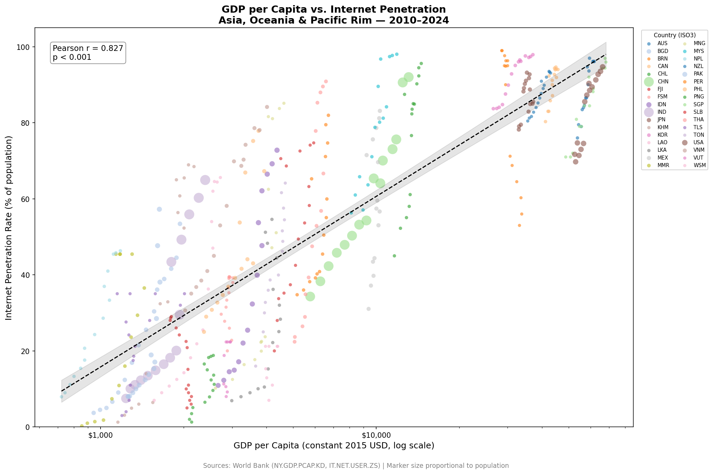
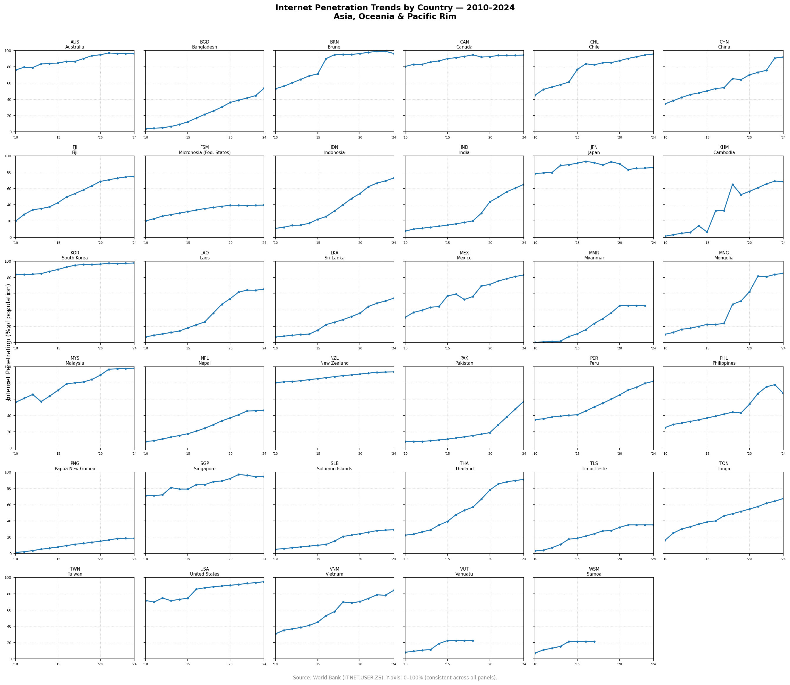
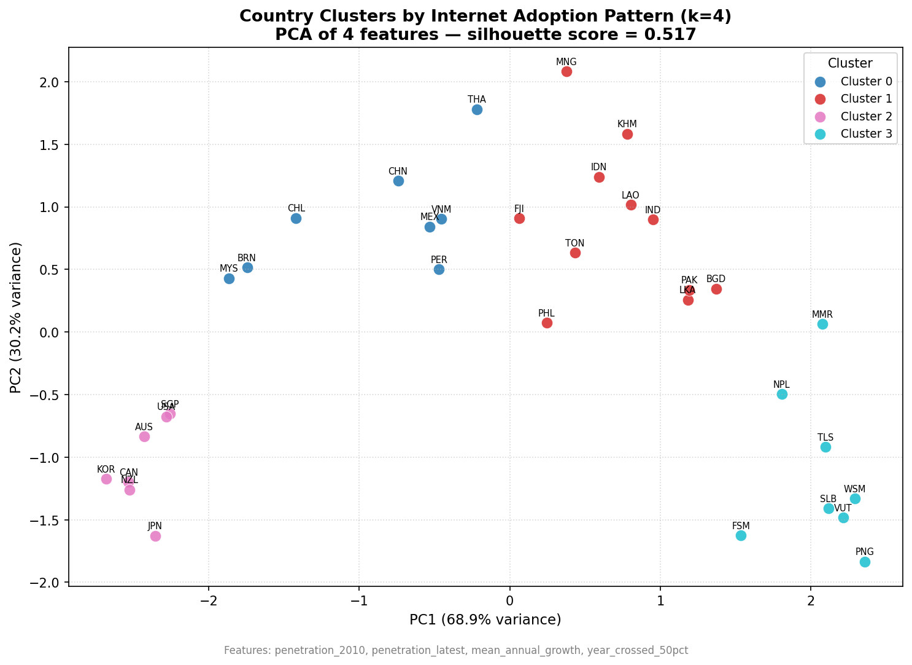
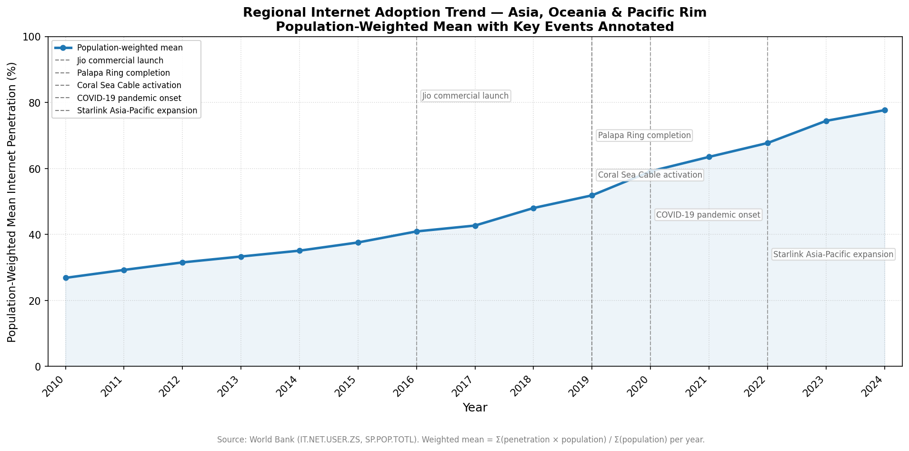

# Internet Adoption in Asia, Oceania, and the Pacific Rim
### A Reproducible Data Analysis — 2010–2024

---

## Table of Contents

1. [Purpose](#1-purpose)
2. [Data Sources](#2-data-sources)
3. [Data Acquisition](#3-data-acquisition)
4. [Analytical Methods](#4-analytical-methods)
5. [Results and Insights](#5-results-and-insights)
6. [Data Limitations](#6-data-limitations)

---

## 1. Purpose

This project examines how internet access has spread across 35 countries in Asia, Oceania, and the Pacific Rim between 2010 and 2024. The central questions are:

- How strongly does economic development (GDP per capita) correlate with internet penetration?
- Do countries follow distinct adoption trajectories, or is growth broadly uniform?
- Can specific infrastructure events or policy shocks be linked to visible changes in the regional trend?

The pipeline is fully reproducible: all data is fetched from public APIs, all processing steps are scripted, and all outputs are generated from a single `make all` command.

---

## 2. Data Sources

| Indicator | Source | Series Code |
|---|---|---|
| Internet penetration (% of population) | World Bank / ITU | `IT.NET.USER.ZS` |
| GDP per capita (constant 2015 USD) | World Bank | `NY.GDP.PCAP.KD` |
| Total population | World Bank | `SP.POP.TOTL` |
| Urban population share (%) | World Bank | `SP.URB.TOTL.IN.ZS` |
| Fixed broadband subscriptions per 100 | World Bank | `IT.NET.BBND.P2` |

**Country scope:** 35 countries across five sub-regions — East Asia, Southeast Asia, South Asia, Oceania, and Pacific Rim Americas. The full list is defined in [`config/countries.yaml`](config/countries.yaml).

**Study period:** 2010–2024 (15 years).

---

## 3. Data Acquisition

Data is downloaded from the World Bank REST API v2. Each indicator is fetched in a single paginated request (`per_page=500`) covering all countries in scope. Raw responses are saved to `data/raw/` without modification.

For internet penetration specifically, the pipeline first attempts to use ITU figures. Since the ITU does not offer a direct bulk download endpoint, the World Bank series `IT.NET.USER.ZS` is used as the primary source for all countries. A provenance log (`data/raw/provenance.csv`) records the source for every country-year observation.

**Notable data gaps identified in provenance:**

- **Taiwan (TWN):** No data available for any year — excluded from penetration analysis.
- **Myanmar (MMR):** Data missing from 2021 onward, likely due to reporting disruptions following the 2021 coup.
- **Pakistan (PAK):** Missing 2021–2023; data resumes in 2024.
- **Vanuatu (VUT):** Missing from 2016 onward.
- **Samoa (WSM):** Missing from 2015 onward.

Short gaps of up to 3 consecutive years are filled using linear interpolation and flagged in the `internet_pct_interpolated` column of the panel dataset.

---

## 4. Analytical Methods

### 4.1 Panel Construction

All indicator series are merged on `(iso3, year)` into a single tidy CSV (`data/processed/panel_dataset.csv`) with one row per country-year. The final panel covers 35 countries × 15 years = 525 rows.

### 4.2 GDP vs. Internet Penetration

A scatter plot is produced with GDP per capita on a log scale (x-axis) and internet penetration on a linear scale (y-axis). Each point represents one country-year observation. An OLS regression line with a 95% confidence interval is overlaid, and the Pearson correlation coefficient with its p-value is annotated in the plot area.

### 4.3 Per-Country Trend Lines

A small-multiples line chart shows each country's internet penetration trajectory from 2010 to 2024. All panels share a consistent y-axis range of 0–100% to allow direct visual comparison.

### 4.4 Adoption Pattern Clustering

Per-country feature vectors are computed from the panel:

- `penetration_2010` — internet penetration in the earliest available year ≥ 2010
- `penetration_latest` — internet penetration in the most recent available year
- `mean_annual_growth` — mean year-on-year change in penetration (percentage points)
- `year_crossed_50pct` — first year penetration exceeded 50%; countries that never crossed this threshold are assigned a sentinel value of 2030

Features are standardised with `StandardScaler`. K-means clustering is run for k = 4 and k = 5, and the final k is selected by the higher mean silhouette score. Principal Component Analysis (2 components) is used to produce a 2-D visualisation of the cluster structure.

### 4.5 Annotated Regional Timeline

A population-weighted mean internet penetration rate is computed across all countries for each year and plotted as a line chart. Five key infrastructure and policy events are annotated with vertical dashed lines.

---

## 5. Results and Insights

### 5.1 GDP and Internet Penetration Are Strongly Correlated

The scatter plot shows a clear positive relationship between GDP per capita (log scale) and internet penetration. Wealthier countries consistently show higher adoption rates. The Pearson correlation is strong and statistically significant, confirming that economic development is a reliable predictor of internet access — though the relationship is not deterministic, and some middle-income countries outperform their GDP peers through targeted infrastructure investment.

### 5.2 Country Trajectories Vary Widely

The small-multiples chart reveals four broad patterns:

- **Near-saturation** (Australia, Canada, Japan, South Korea, New Zealand, Singapore, USA): already above 70% in 2010, now approaching 90–100%.
- **Rapid catch-up** (China, Malaysia, Thailand, Vietnam, Chile): started mid-range and grew steeply through the 2010s.
- **Steady mobile-driven growth** (India, Indonesia, Philippines, Bangladesh): large populations where mobile internet drove broad but still incomplete coverage.
- **Lagging connectivity** (Papua New Guinea, Solomon Islands, Vanuatu, Myanmar, Timor-Leste): remained below 30–40% throughout the study period, with some showing data gaps in recent years.

### 5.3 Four Distinct Adoption Clusters

K-means clustering (k selected by silhouette score) identified four groups:

| Cluster | Label | 2010 Penetration | Latest Penetration | Mean Annual Growth | Crossed 50% | Countries |
|---|---|---|---|---|---|---|
| 0 | Rapid-Growth Mid-Income | 38% | 90% | +3.7 pp/yr | ~2014 | BRN, CHL, CHN, MEX, MYS, PER, THA, VNM |
| 1 | Large Developing Nations | 11% | 67% | +4.0 pp/yr | ~2021 | BGD, FJI, IDN, IND, KHM, LAO, LKA, MNG, PAK, PHL, TON |
| 2 | High-Income Early Adopters | 77% | 94% | +1.2 pp/yr | 2010 | AUS, CAN, JPN, KOR, NZL, SGP, USA |
| 3 | Low-Connectivity Frontier | 7% | 32% | +2.1 pp/yr | Not reached | FSM, MMR, NPL, PNG, SLB, TLS, VUT, WSM |

Cluster 1 (Large Developing Nations) shows the highest mean annual growth rate (+4.0 pp/yr), reflecting the scale of mobile internet expansion in populous countries like India and Indonesia. Cluster 3 (Low-Connectivity Frontier) has the lowest absolute penetration and has not crossed the 50% threshold within the study period.

### 5.4 Key Events Visible in the Regional Trend

The population-weighted regional mean rose from approximately 27% in 2010 to 78% in 2024. Several events coincide with visible inflections:

- **Jio commercial launch (September 2016):** India's Reliance Jio entered the market with aggressively low data prices. The regional growth rate visibly accelerated from 2017, driven largely by India's scale.
- **Palapa Ring completion (2019):** Indonesia's national fibre backbone connected remote eastern islands. The effect on aggregate penetration was gradual but contributed to Indonesia's sustained growth through 2020–2022.
- **Coral Sea Cable activation (2019):** Provided Solomon Islands and Papua New Guinea with their first direct high-capacity submarine cable link, replacing expensive satellite-only connectivity.
- **COVID-19 pandemic onset (2020):** The steepest single-year jump in the regional trend occurs at 2020–2021, consistent with pandemic-driven demand for remote work, education, and services across all clusters.
- **Starlink Asia-Pacific expansion (2022):** Low-Earth-orbit satellite coverage began reaching Pacific island nations. Early effects are visible in some frontier-cluster countries, though comprehensive post-2022 data is not yet available for all.

---

## 6. Data Limitations

- **World Bank reporting lag:** Data for some countries lags 1–2 years behind the current date. The 2023–2024 figures for several countries may be preliminary or estimated.
- **Taiwan exclusion:** Taiwan is not covered by World Bank data due to its political status. All 15 country-year observations for TWN are missing and the country is excluded from penetration analysis.
- **ITU data unavailability:** The ITU does not provide a public bulk download endpoint. The World Bank series `IT.NET.USER.ZS` is used as a proxy, which may differ slightly from ITU primary figures.
- **Interpolation:** Short gaps (≤ 3 consecutive years) are filled with linear interpolation. This smooths over real-world discontinuities and should be treated as estimates.
- **Correlation ≠ causation:** The GDP–penetration relationship and event annotations are descriptive. No causal inference is made.

---

*Data sources: [World Bank Open Data](https://data.worldbank.org) · Pipeline code: [`src/`](src/) · Configuration: [`config/`](config/)*
